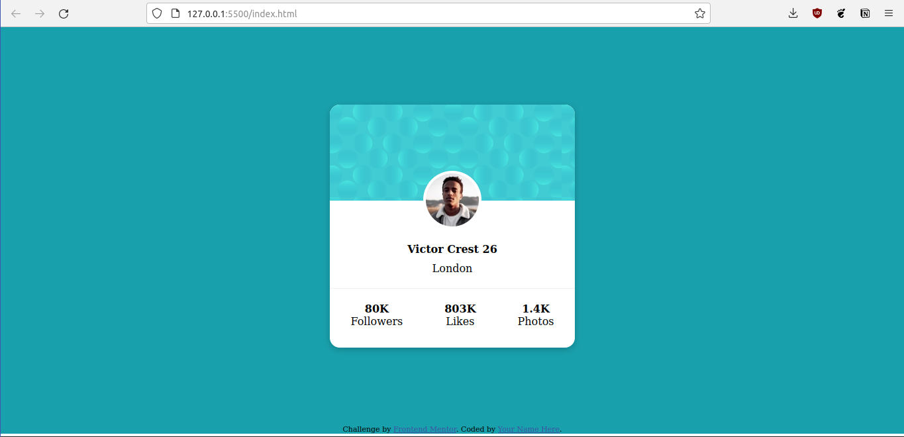

# Frontend Mentor - Profile card component solution

This is a solution to the [Profile card component challenge on Frontend Mentor](https://www.frontendmentor.io/challenges/profile-card-component-cfArpWshJ). Frontend Mentor challenges help you improve your coding skills by building realistic projects. 

## Table of contents

- [Overview](#overview)
  - [The challenge](#the-challenge)
  - [Screenshot](#screenshot)
  - [Links](#links)
- [My process](#my-process)
  - [Built with](#built-with)
- [Author](#author)

**Note: Delete this note and update the table of contents based on what sections you keep.**

## Overview

### The challenge

- Build out the project to the designs provided

### Screenshot

### Links

- Solution URL: [https://www.frontendmentor.io/solutions/profile-card-component-solution-EaVeO3hpN](https://www.frontendmentor.io/solutions/profile-card-component-solution-EaVeO3hpN)
- Live Site URL: [https://sad-mcnulty-e31aae.netlify.app/](https://sad-mcnulty-e31aae.netlify.app/)

## My process

### Built with

- Semantic HTML5 markup
- Flex
- CSS Grid

## Author

- Frontend Mentor - [@brilliantDjaka](https://www.frontendmentor.io/profile/brilliantDjaka)
- Github - [@brilliantDjaka](https://www.github.com/brilliantDjaka)
